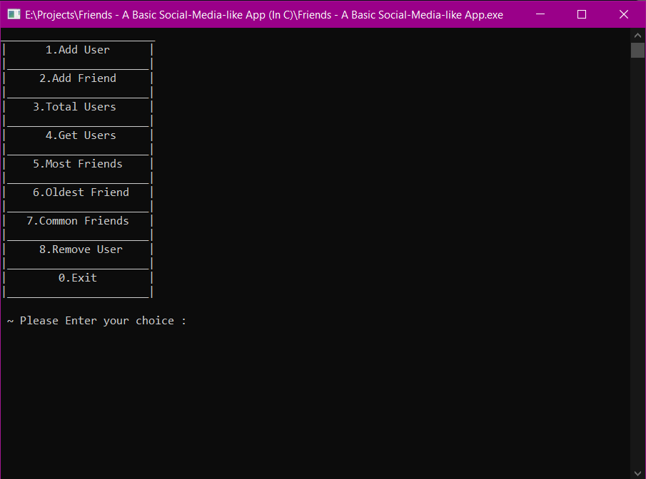
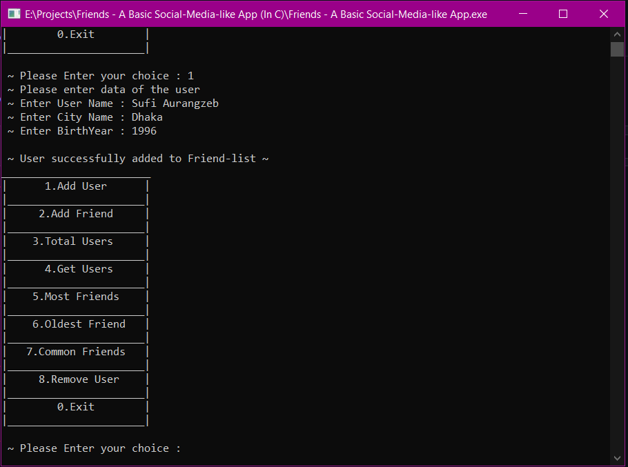
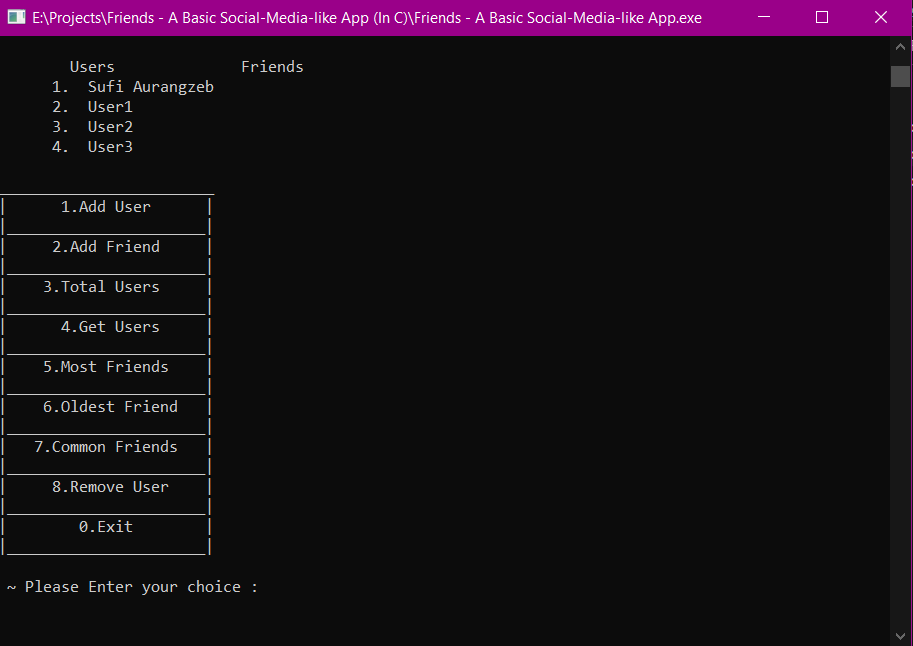
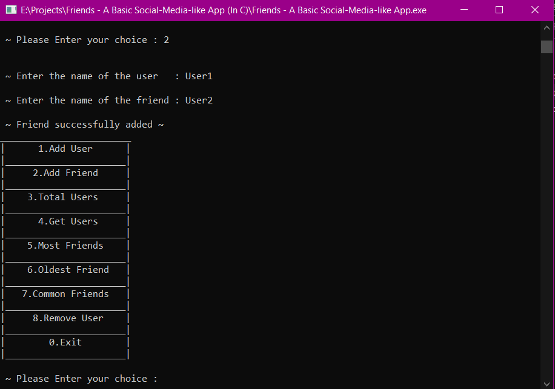
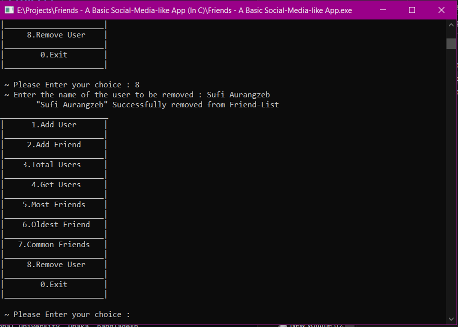
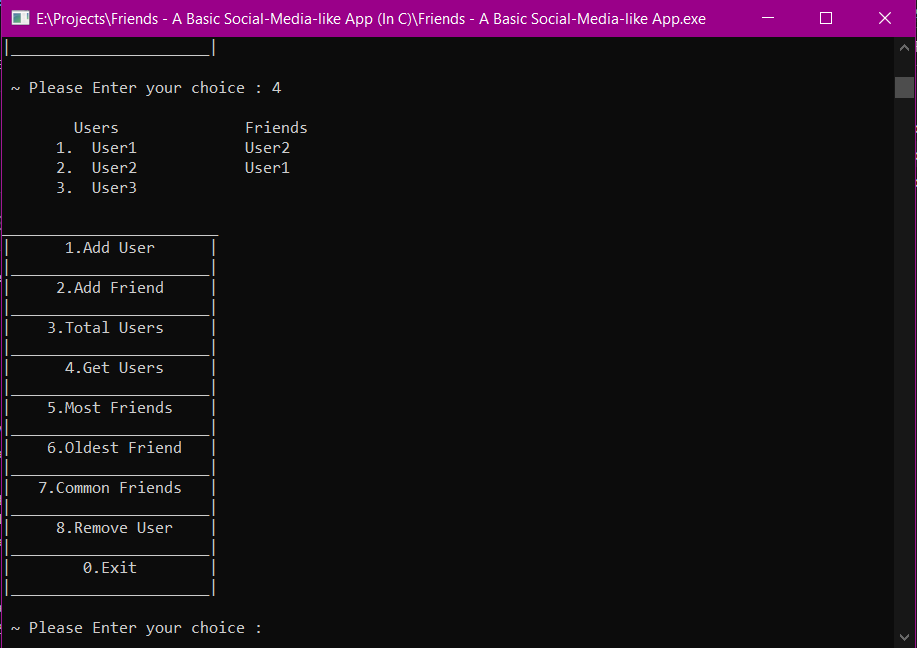

<h1> Friends - A Basic Social-Media-like App </h1>

<h1> Glimpses of the app </h1>

    

        
        
    

    

        
        
    

    

        
        
    

# Features
- Create User
- Add Friends
- View Users
- Delete Users
- See User with Most Friends
- See Common Friends of Two users

# Developed using
- C Programming Language
- Concepts covered: Arrays, String, Structures, Linked-Lists, etc.

# Developed by
### Sufi Aurangzeb Hossain
BSc in Computer Science & Engineering
United International University, Dhaka, Bangladesh.
